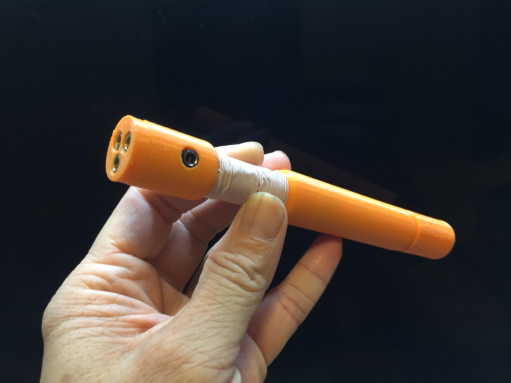
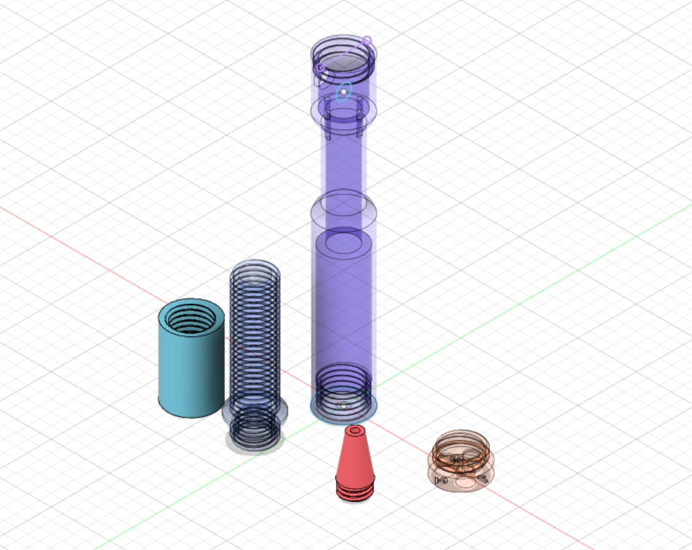

# Pen Crystal Radio
#
# Designed by cheungbx (c) 2020.08.07 - free for personal use. 
# Use on commercial and resellable products are not authorized.

click the picture below to view the demonstration and DIY video.

# The following original design files are included for you to custimize the design for your own need.
#
# *.f3d file is the archive file exported from Autodesk Fusion 360.
# *..stl is the common 3D design format.
#
# 3D printing instructions for Ender3 Pro : Take defaults for PLA material with these adjustments: Infill 40%,   Support off.
3

# more instructions in this youtube video:

https://youtu.be/t1FxCKXK-P4
